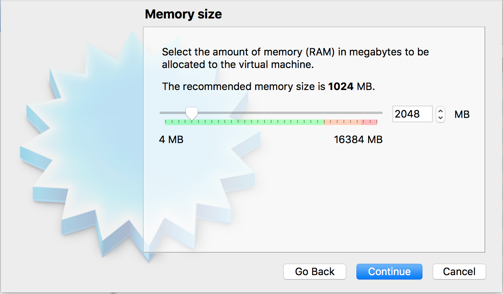
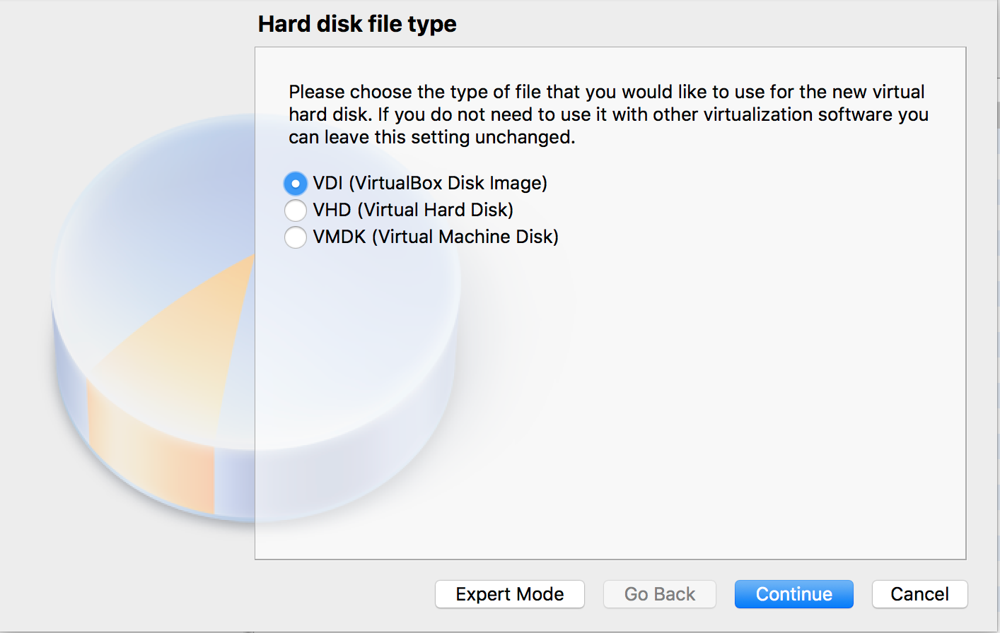
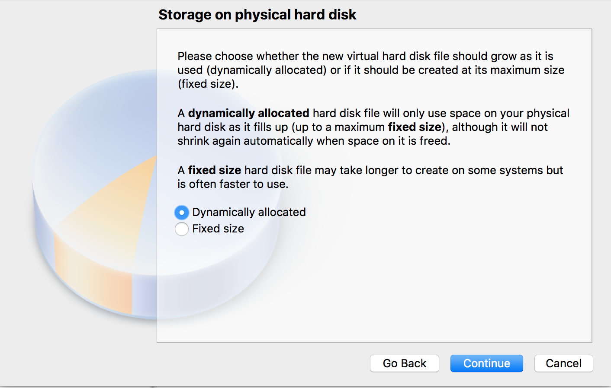
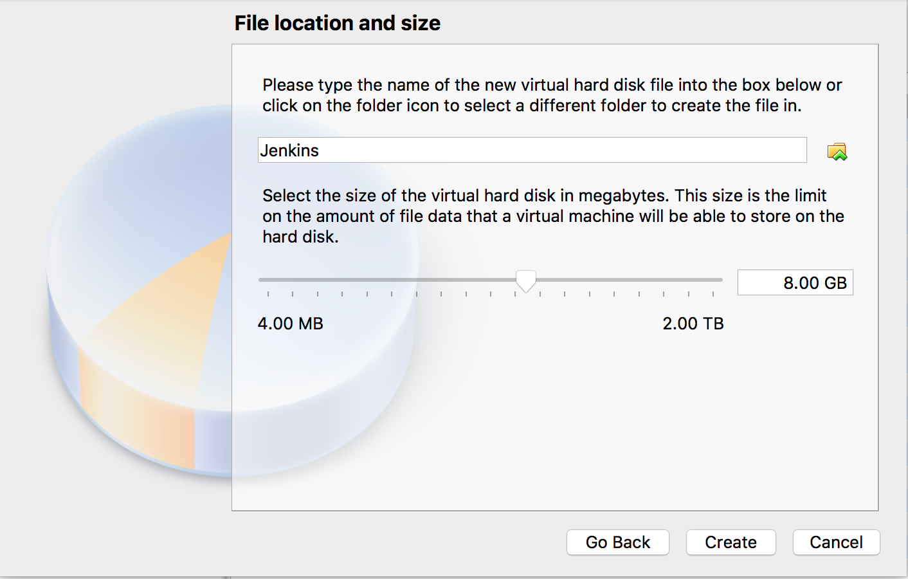
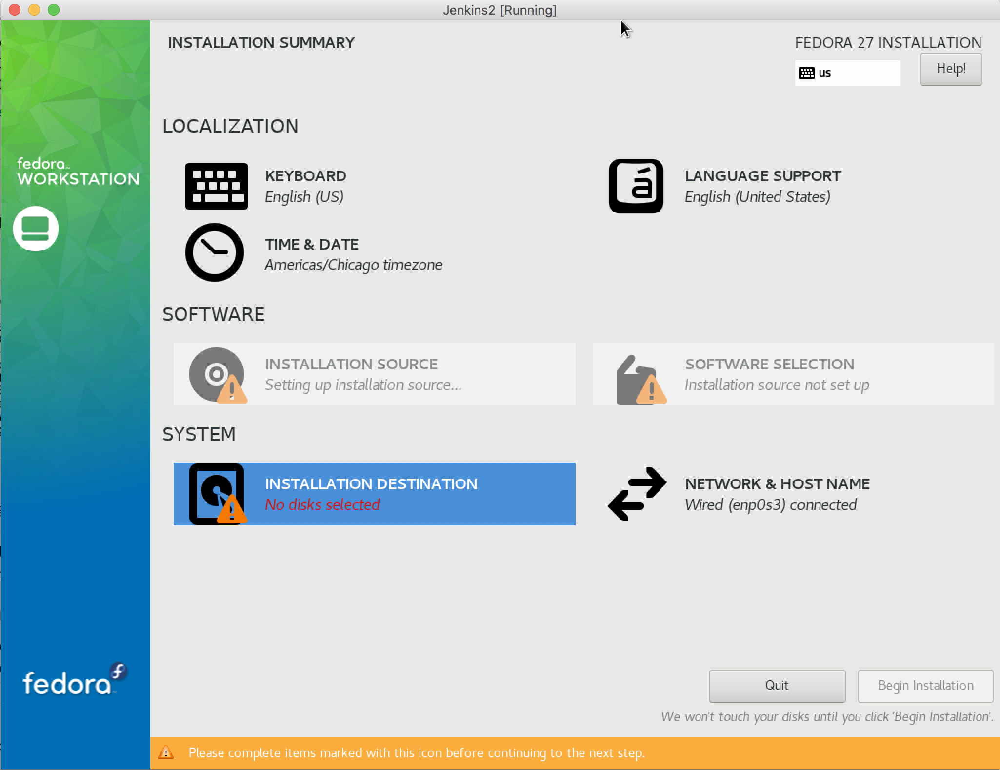
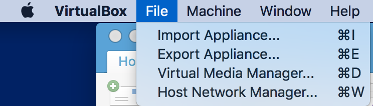
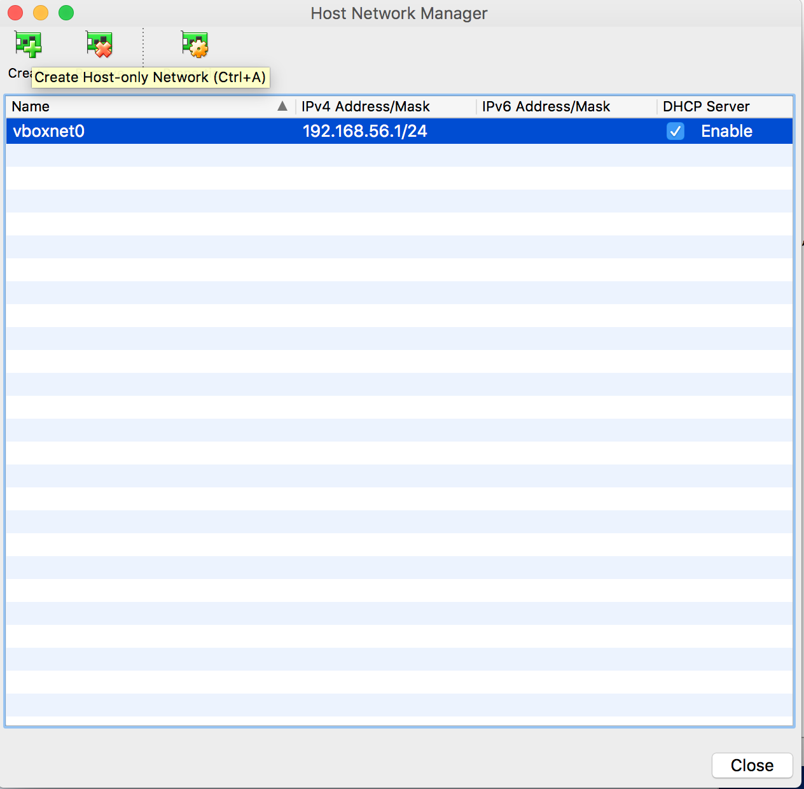
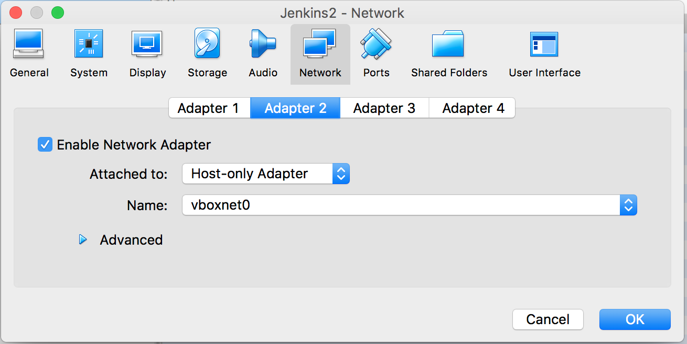
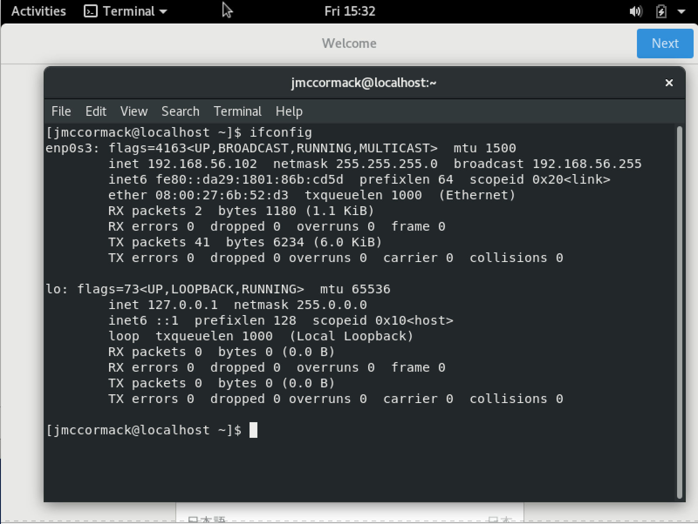

# Deploying Angular Apps on Heroku With Jenkins (For Free!)

# Part 1: Background

Today we'll be walking through an end to end CI/CD pipeline using Jenkins. We'll run tests, check our formatting, and push new builds up to Heroku! All on a local VM and all for free!

# Part 1: Setting up the VM

## i. Getting the image and virtual box

There are a lot of different places to start here. I chose to use VirtualBox and Fedora but you can really use any linux os here. You can download virtual box [here](https://www.virtualbox.org/wiki/Downloads) and download fedora [here](https://getfedora.org/en/workstation/download/). Make sure to download the iso for Fedora and not the installer. 

## ii. Setting up The VM

First install VirtualBox and once that's finished open it up. In the top left corner click on "New."


Then in the pop up window fill in the details like below:


Then select how much memory you want to allocate, I recommend at least 2048 MB if your computer has the space. 



Then enter in a title and a Primary Key. For this project, our primary key will be the UserID which we will store as a string. After selecting these two parameters click create. We now have a nice and shiny NoSQL Database to work out of. You can click the "Items" tab at the top to take a look at the database structure but there isn't much to see yet so we'll come back to look at this later.


Next we'll want to configure the hard disk space for the VM. I typically just stick with the default format of VDI. 

Then select storage size and type. I would do dynamically allocated but 16 GB will be a lot better than starting with 8 if you can spare the HD space. 



When you're done your window should look like the below image but you'll probably only have one Jenkins VM (And it will probably be powered off). 


Now we actually need to install Fedora into the VM. To do this, Select the VM, then click Settings. 


The click the "Storage" tab, and then click on "Empty" under `controller:IDE`.


Then click on the small CD and either select `Choose Virtual Optical Disk File...` or, if the option is there, just click on the iso in the list. Also click on the `Live CD/DVD` checkbox. 


Click OK, then click on `Start` and then `Normal Start`

## iii. Installing the OS

When the window starts up, highlight "Install Fedora" with the arrow keys and then hit enter. 


Select your language and keyboard layout then click next. When you get to this screen:



First select Installation Destination. There should be only one option, click it then hit done at the top. If you get an error about there not being enough disk space, just shutdown the VM and expand the Hard Drive space or create a new hard drive under the tab where we picked the live cd to use in settings. You may then have to wait on the page for a bit while the `installation source` and `software selection` fields are populated. This will happen automatically so just wait and then click begin installation once it fills in. 


Next, click on the `Root Pasword` and `User Creation` pages to set up an account for yourself. 


Again, there will be some more waiting while everything downloads. This will take awhile as it has to download about 1.5 Gigs of files. Once everything installs, click the reboot button. We have to "eject" the live CD or else it will just keep looping into the installation menu. 

To do that first we need to power down the machine:


Then eject the disk


Now start the drive back up again and login using the credentials you set in the installation step. 


## iv. Configuring SSH

This step is optional but I highly recommend it. In the current configuration, we have to use the VirtualBox window. But let's reconfigure the system so we can ssh into the VM from our host machine. It's pretty straight forward. Power down the machine again. Then click on File > Host Network Manager:



Then click "Create" if there isnt anything there:



Then jump back to the VM's settings, click network, then select adapter 2, enable network adapter, select host-only adapter, and then for the name pick the network you just created.



Start the VM back up and login to it. Open up a terminal and type:



This IP address is the one we'll use to ssh into the box. Now we have to setup the ssh server. Run the following commands:

```Shell
    sudo yum install openssh-server
    sudo systemctl start sshd.service;
    sudo systemctl enable sshd.service;
```

These will install the server, start the server, and then make sure the server starts at boot each time. Now go to a terminal on your host computer (or Putty on Windows) and type:

```Shell
    ssh <your_username>@<VM's IP Address>
```
So for example:
```Shell
    ssh jmccormack@192.168.56.102
```

# Part 3: Installing Jenkins

First, let's install Java.

```Shell
    sudo yum install java
```
Now we can install Jenkins through their repo:

```Shell
sudo wget -O /etc/yum.repos.d/jenkins.repo http://pkg.jenkins-ci.org/redhat/jenkins.repo

sudo rpm --import https://jenkins-ci.org/redhat/jenkins-ci.org.key
sudo yum install jenkins
```

Then we can start Jenkins by running:

```Shell
sudo service jenkins start
sudo chkconfig jenkins on
```

Now if you open a browser on your host machine and go to `http://<IP_ADDR>:8080/` you should see a screen like the one below:


To get the password we need just open the file listed in your ssh session:

```Shell
    sudo cat /var/lib/jenkins/secrets/initialAdminPassword
```

The code that pops out will be your password, enter it in the web portal.In the next window, select `Install Recommended Plugins`.
