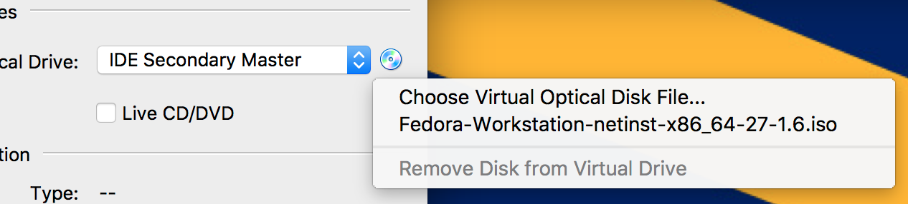

# Deploying Angular Apps on Heroku With Jenkins (For Free!)

# Part 1: Background

Today we'll be walking through an end to end CI/CD pipeline using Jenkins. We'll run tests, check our formatting, and push new builds up to Heroku! All on a local VM and all for free!

# Part 1: Setting up the VM

## i. Getting the image and virtual box

There are a lot of different places to start here. I chose to use VirtualBox and Fedora but you can really use any linux os here. You can download virtual box [here](https://www.virtualbox.org/wiki/Downloads) and download fedora [here](https://getfedora.org/en/workstation/download/). Make sure to download the iso for Fedora and not the installer. 

## ii. Setting up The VM

First install VirtualBox and once that's finished open it up. In the top left corner click on "New."


Then in the pop up window fill in the details like below:


Then select how much memory you want to allocate, I recommend at least 2048 MB if your computer has the space. 


Then enter in a title and a Primary Key. For this project, our primary key will be the UserID which we will store as a string. After selecting these two parameters click create. We now have a nice and shiny NoSQL Database to work out of. You can click the "Items" tab at the top to take a look at the database structure but there isn't much to see yet so we'll come back to look at this later.


Next we'll want to configure the hard disk space for the VM. I typically just stick with the default format of VDI. 

Then select storage size and type. I would do dynamically allocated but 16 GB will be a lot better than starting with 8 if you can spare the HD space. 


When you're done your window should look like the below image but you'll probably only have one Jenkins VM (And it will probably be powered off). 


Now we actually need to install Fedora into the VM. To do this, Select the VM, then click Settings. 


The click the "Storage" tab, and then click on "Empty" under `controller:IDE`.


Then click on the small CD and either select `Choose Virtual Optical Disk File...` or, if the option is there, just click on the iso in the list. Also click on the `Live CD/DVD` checkbox. 



Click OK, then click on `Start` and then `Normal Start`

## iii. Installing the OS

When the window starts up, highlight "Install Fedora" with the arrow keys and then hit enter. 


Select your language and keyboard layout then click next. When you get to this screen:


First select Installation Destination. There should be only one option, click it then hit done at the top. If you get an error about there not being enough disk space, just shutdown the VM and expand the Hard Drive space or create a new hard drive under the tab where we picked the live cd to use in settings. You may then have to wait on the page for a bit while the `installation source` and `software selection` fields are populated. This will happen automatically so just wait and then click begin installation once it fills in. 


Next, click on the `Root Pasword` and `User Creation` pages to set up an account for yourself. 


Again, there will be some more waiting while everything downloads. This will take awhile as it has to download about 1.5 Gigs of files. Once everything installs, click the reboot button. We have to "eject" the live CD or else it will just keep looping into the installation menu. 

To do that first we need to power down the machine:


Then eject the disk


Now start the drive back up again and login using the credentials you set in the installation step. 


## iv. Configuring SSH

This step is optional but I highly recommend it. In the current configuration, we have to use the VirtualBox window. But let's reconfigure the system so we can ssh into the VM from our host machine. It's pretty straight forward. Power down the machine again. Then click on File > Host Network Manager:


Then click "Create" if there isnt anything there:


Then jump back to the VM's settings, click network, then select adapter 2, enable network adapter, select host-only adapter, and then for the name pick the network you just created.


Start the VM back up and login to it. Open up a terminal and type:


This IP address is the one we'll use to ssh into the box. Now we have to setup the ssh server. Run the following commands:

```Shell
    sudo yum install openssh-server
    sudo systemctl start sshd.service;
    sudo systemctl enable sshd.service;
```

These will install the server, start the server, and then make sure the server starts at boot each time. Now go to a terminal on your host computer (or Putty on Windows) and type:

```Shell
    ssh <your_username>@<VM's IP Address>
```
So for example:
```Shell
    ssh jmccormack@192.168.56.102
```

# Part 3: Installing Jenkins

First, let's install Java.

```Shell
    sudo yum install java
```
Now we can install Jenkins through their repo:

```Shell
sudo wget -O /etc/yum.repos.d/jenkins.repo http://pkg.jenkins-ci.org/redhat/jenkins.repo

sudo rpm --import https://jenkins-ci.org/redhat/jenkins-ci.org.key
sudo yum install jenkins
```

Then we can start Jenkins by running:

```Shell
sudo service jenkins start
sudo chkconfig jenkins on
```

Now if you open a browser on your host machine and go to `http://<IP_ADDR>:8080/` you should see a screen like the one below:


To get the password we need just open the file listed in your ssh session:

```Shell
    sudo cat /var/lib/jenkins/secrets/initialAdminPassword
```

The code that pops out will be your password, enter it in the web portal.In the next window, select `Install Recommended Plugins`. When prompted, create a user login for yourself. Jenkins is now ready to go! Now we can start on the fun part. 

# Part 4: Configuring Jenkins

## Prework: Create a heroku account and a bot github account

Before we start, go to heroku and make a new account if you dont have one. Even if you have your own github account, I highly recommend creating a "bot" account. This will become the identity for your jenkins machine and will things cleaner in the future. If you expand your team you can feel comfortable passing this account around if needed and it won't be tied to you as a person. 

## Prework: Setup a Github Repo and Heroku Project

First, let's create a new github repository. If you want to save some time, you can just fork the one I used from [here](https://github.com/jmccormack200/AngularJenkins). Its essentially a typical angular starter project with some slight changes that I'll go over as we go through this.

Then log into your Heroku account and create a new heroku app. 

## Creating a PR Builder

We'll start with the PR Builder. Everytime we open a new PR this will:
  1. Run our tests
  1. Build the app
  1. Run prettier to check for formatting issues

  On the main page click on "Create new jobs"


Then give it a name that includes -pr-builder (or something so you can differentiate it from the project builder) and click "Freestyle project" followed by "Ok".


Now we can start configuring the Jenkins project itself. To start, let's give it information about our Git project. Follow along below and change things for your project as needed. The part under Refspec and Branc Specifier allows us to point to whatever PR has just been updated or opened. Under Credentials, you can select the default and it will prompt you for a username and password. This is where you'll give Jenkins the username and password for the bot account you made in the earlier step. You can also use SSH keys or another method to authenticate the account. 


Now, under build triggers see if there's a section for "Github Pull Request Builder", if there is jump down a bit, otherwise follow along. We need to install a new plugin in Jenkins. Hit save at the bottom to save what you've done so far, then jump back to the Jenkins homepage and click `Manage Plugins`.


Then search for "Github" and select the PR Builder. As a warning, there was a security flaw with earlier versions of this plugin, make sure to read the warning if you installed anything older than 1.40.0. At the bottom of the page, click download now and install after restart. You may have to check a box that says "restart now". Jenkins will go offline briefly and when it comes back you'll have the new plugin.


Now if you go under "Build Triggers" you should have an option for "Github pull request builder." Click on it and check that everything looks like the image below. Now a note here is that we're going to just be polling github every 5 minutes to see if there's a change. If we move this VM up to an AWS instance or some other area where its exposed to the world we can use Github webhooks instead. These are a much better solution but to keep things simple (and Free) we're going to just use the Crontab line. 


Now under the build tab let's add an `Execute Shell` Stage:


Now let's add the tasks we want to run:

```Shell
    npm install
    ng build
    ng test
```


This will build and test our app. If either step fails, the build will fail and then we'll be unable to merge our PR. 

We're going to add a post build step to run prettier and make sure there are no formatting errors. If you aren't using a fork of my repo, open your `package.json` file and add this under scripts:

```Javascript
    "scripts": {
        "format": "prettier --single-quote --trailing-comma es5 --write \"{src/app,__{tests,mocks}__}/**/*.ts\""
    }

```

And also install prettier with:
```Shell
    npm install --save-dev prettier
```

While we're here, I should also mention that Karma defaults to using Chrome, but Fedora comes with Firefox. Let's switch Karma to use firefox. You can always install Chrome later and switch back. First go [here](https://github.com/jmccormack200/AngularJenkins/blob/master/karma.conf.js) and copy my karma config file. This will switch the tests over to using firefox and also allow us to output an xml file that Jenkins can use to display a graph of our code coverage.

## <b>Important:</b>
We also need to make a slight update to add a server for heroku to use. If you follow this tutorial:  [https://medium.com/@ryanchenkie_40935/angular-cli-deployment-host-your-angular-2-app-on-heroku-3f266f13f352](https://medium.com/@ryanchenkie_40935/angular-cli-deployment-host-your-angular-2-app-on-heroku-3f266f13f352)

Then run:
```Shell
    npm install --save-dev karma-firefox-launcher
    npm install --save-dev karma-junit-reporter
```

Now under "Post build Actions add a post-build task, if you don't have that option install the plugin the same way we installed the github plugin. 


Now add the following code under the script section of post build tasks:

```Shell
npm run format
git diff
git diff --quiet || \
echo "Prettier Found Differences, please clean project and try again" || \
exit 1
git diff --quiet && \
exit 0
```

Basically, this runs the prettier script we created, then checks to see if there's a difference. If there are, it fails the build.


And we're done! Now we can move on to making the Project Builder and deploying to Heroku:

## Creating a Project Builder

The project builder will be really similar to the PR builder but with a few key differences. It will only build when something is merged into master, and it will also upload the final build to our heroku app. 

Before we begin, we need to get our jenkins VM registered with our Heroku app. First download the heroku cli tools [here](https://devcenter.heroku.com/articles/heroku-cli). Then hop back into an ssh session with your user account. Now type:

```Shell
    sudo su -s /bin/bash jenkins
    whoami
```

When you type whoami it should return "jenkins". We've essentially just opened a shell as the jenkins user. Now we can generate a new RSA key, and add it to heroku. 

Then type:

```Shell
    heroku login
    ssh-keygen -t rsa -C "your_email@example.com"
    heroku keys:add
```

Then copy the key you just added to heroku by either navigating to their web portal or by typing

```Shell
    sudo cat /var/lib/jenkins/.ssh/id_rsa
```

We still need to let Jenkins know about this key, we'll do that in a minute. 

Now, create a new project in Jenkins and navigate down to the `Source Code Management` section. We're going to create two "repository" entries, one for Github and one for Heroku. Fill in your information as appropriate.


Under the Credentials tab for heroku, click the "Add" and "Jenkins" Button. And enter your heroku username and ssh key that you copied from earlier. 


Our Build Section will be the same as before:


Our post build actions will contain a JuNit Test result Report:


And a Git Publisher to push to Heroku:


And that's it! Now when a build kicks off from master we'll get an update to our test reports and we can see the results on Heroku!!!

